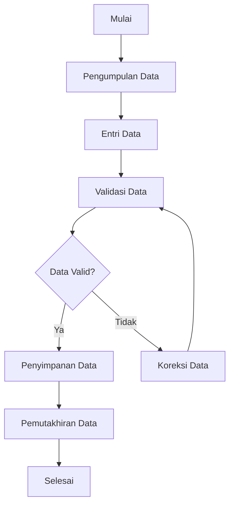
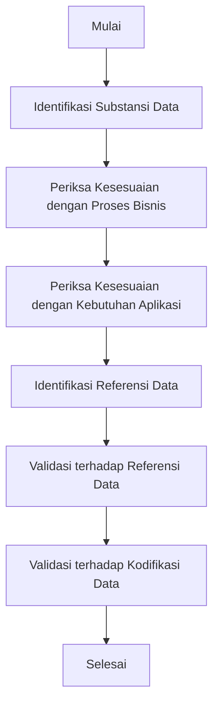
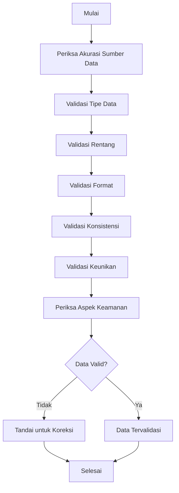
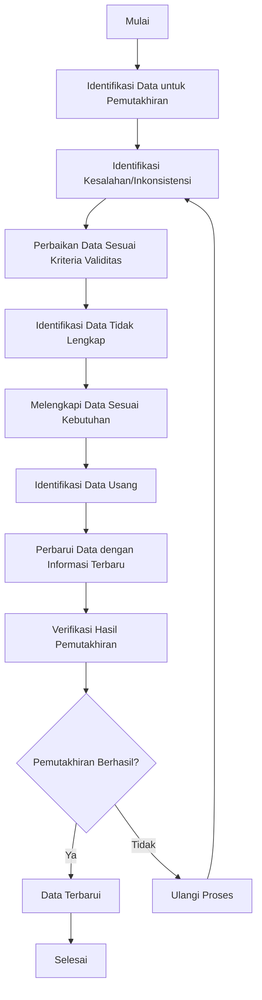

# Materi Pembelajaran: Memastikan Validitas Data
## Unit Kompetensi J.63OPR00.015.2

## Pendahuluan

Materi pembelajaran ini disusun berdasarkan unit kompetensi J.63OPR00.015.2 tentang "Memastikan Validitas Data". Unit kompetensi ini berkaitan dengan pengetahuan, keterampilan, dan sikap kerja yang dibutuhkan untuk memastikan validitas data yang dimasukkan dengan perangkat komputer.

Dalam era digital saat ini, data menjadi aset penting bagi organisasi. Memastikan validitas data merupakan langkah krusial untuk mendukung proses bisnis yang efektif dan pengambilan keputusan yang tepat. Materi ini akan membahas secara komprehensif tentang konsep validasi data, identifikasi substansi data, referensi data, pemeriksaan validitas, dan pemutakhiran data.

## Daftar Isi

1. **Mengidentifikasi Substansi Data yang Dimasukkan**
   - Kesesuaian Data dengan Keperluan Proses Bisnis Organisasi
   - Kesesuaian Jenis Data dengan Kebutuhan Aplikasi

2. **Mengidentifikasi Referensi dari Data yang Dimasukkan**
   - Identifikasi Jenis Data Sesuai Referensi Data
   - Kesesuaian Data dengan Kodifikasi

3. **Memeriksa Validitas Data**
   - Akurasi Sumber Data Sesuai Kebutuhan Organisasi
   - Pemeriksaan Akurasi Data yang Dimasukkan
   - Aspek Keamanan Informasi dalam Validasi Data

4. **Melakukan Pemutakhiran Data**
   - Perbaikan Data Sesuai Kriteria Validitas
   - Melengkapi Data yang Tidak Lengkap
   - Pemutakhiran Sesuai Data Terbaru

5. **Konsep Dasar Validasi Data**
   - Pengertian dan Jenis Validasi Data
   - Tipe-Tipe Pemeriksaan Validasi Data
   - Manfaat Validasi Data

6. **Referensi**

## Proses Validasi Data Secara Umum

Berikut adalah flowchart yang menggambarkan proses validasi data secara umum:

## 1. Mengidentifikasi Substansi Data yang Dimasukkan

Proses identifikasi substansi data merupakan langkah awal yang penting dalam memastikan validitas data. Berikut adalah flowchart proses identifikasi data:

### 1.1 Kesesuaian Data dengan Keperluan Proses Bisnis Organisasi

Proses bisnis organisasi memerlukan data yang relevan, akurat, dan tepat waktu untuk mendukung operasional dan pengambilan keputusan. Identifikasi substansi data harus mempertimbangkan:

- **Relevansi Data**: Data yang dikumpulkan harus relevan dengan tujuan bisnis organisasi. Data yang tidak relevan dapat menghabiskan sumber daya penyimpanan dan mempersulit analisis.

- **Nilai Bisnis Data**: Setiap data yang dimasukkan harus memiliki nilai bisnis yang jelas. Nilai ini dapat berupa dukungan terhadap pengambilan keputusan, peningkatan efisiensi operasional, atau pemenuhan kebutuhan pelanggan.

- **Keselarasan dengan Strategi Organisasi**: Data harus mendukung strategi dan tujuan organisasi secara keseluruhan. Misalnya, jika organisasi fokus pada peningkatan layanan pelanggan, data tentang kepuasan pelanggan menjadi sangat penting.

- **Dukungan terhadap Proses Bisnis Spesifik**: Identifikasi proses bisnis mana yang akan didukung oleh data tersebut. Misalnya, data penjualan mendukung proses bisnis pemasaran dan penjualan, sementara data inventaris mendukung proses manajemen rantai pasokan.

**Contoh Praktis:**
Sebuah perusahaan ritel mengumpulkan data transaksi penjualan yang mencakup informasi produk, harga, waktu pembelian, dan metode pembayaran. Data ini sesuai dengan keperluan proses bisnis karena:
- Mendukung analisis penjualan dan tren produk
- Membantu dalam perencanaan inventaris
- Memberikan wawasan tentang perilaku pelanggan
- Memfasilitasi pelaporan keuangan

### 1.2 Kesesuaian Jenis Data dengan Kebutuhan Jenis Data pada Aplikasi

Aplikasi yang berbeda memerlukan jenis data yang berbeda pula. Memastikan kesesuaian jenis data dengan kebutuhan aplikasi meliputi:

- **Tipe Data yang Tepat**: Memastikan bahwa data disimpan dalam format yang sesuai (numerik, teks, tanggal, boolean, dll.) sesuai dengan kebutuhan aplikasi.

- **Format Data yang Konsisten**: Menjaga konsistensi format data, seperti format tanggal (YYYY-MM-DD vs DD-MM-YYYY), format nomor telepon, atau format alamat.

- **Struktur Data yang Sesuai**: Memastikan struktur data (seperti panjang field, jumlah desimal untuk angka, dll.) sesuai dengan spesifikasi aplikasi.

- **Batasan Data**: Memahami dan menerapkan batasan data yang diperlukan oleh aplikasi, seperti nilai minimum/maksimum, karakter yang diizinkan, atau panjang string.

**Contoh Praktis:**
Dalam sistem manajemen karyawan, data yang dimasukkan harus sesuai dengan kebutuhan aplikasi:
- NIK karyawan: format alfanumerik dengan panjang tetap
- Tanggal lahir: format tanggal yang konsisten (YYYY-MM-DD)
- Gaji: nilai numerik dengan dua desimal
- Status pernikahan: nilai boolean (ya/tidak)

## 2. Mengidentifikasi Referensi dari Data yang Dimasukkan

### 2.1 Identifikasi Jenis Data Sesuai Referensi Data

Referensi data berfungsi sebagai standar atau titik perbandingan untuk data lain. Identifikasi jenis data sesuai referensi data meliputi:

- **Set Kode Standar**: Menggunakan set kode standar untuk mengkategorikan atau mengklasifikasikan data, seperti kode industri (KBLI), kode geografis (kode pos), atau kode produk (SKU).

- **Taksonomi dan Hierarki**: Menggunakan klasifikasi hierarkis untuk mengkategorikan data berdasarkan kriteria atau karakteristik tertentu, seperti hierarki organisasi, hierarki produk, atau hierarki pelanggan.

- **Tabel Referensi**: Menggunakan tabel pencarian yang menyimpan nilai data referensi dan makna atau deskripsi yang sesuai, seperti tabel kode negara, tabel mata uang, atau tabel status pesanan.

- **Glosarium dan Standar**: Menggunakan definisi standar dan terminologi yang konsisten untuk memastikan pemahaman yang sama tentang data di seluruh organisasi.

**Contoh Praktis:**
Dalam sistem informasi geografis, data lokasi harus diidentifikasi sesuai dengan referensi data:
- Kode provinsi mengacu pada daftar kode provinsi resmi dari BPS
- Kode kabupaten/kota mengacu pada daftar kode wilayah administratif
- Koordinat geografis mengacu pada sistem koordinat standar (misalnya WGS84)

### 2.2 Kesesuaian Data dengan Kodifikasi dari Data

Kodifikasi data adalah proses mengorganisir data ke dalam format yang terstruktur dan sistematis menggunakan kode atau simbol. Memastikan kesesuaian data dengan kodifikasi meliputi:

- **Penerapan Skema Kodifikasi**: Menggunakan skema kodifikasi yang konsisten dan terstandarisasi untuk mengidentifikasi dan mengkategorikan data.

- **Validasi terhadap Daftar Kode**: Memvalidasi data terhadap daftar kode yang telah ditentukan untuk memastikan keakuratan dan konsistensi.

- **Pemeliharaan Integritas Kode**: Memastikan bahwa kode yang digunakan tetap konsisten dan tidak berubah tanpa proses manajemen perubahan yang tepat.

- **Dokumentasi Kodifikasi**: Mendokumentasikan skema kodifikasi dan maknanya untuk referensi dan pemahaman yang konsisten di seluruh organisasi.

**Contoh Praktis:**
Dalam sistem inventaris, produk dikodifikasi dengan struktur sebagai berikut:
- 2 digit pertama: kategori produk (01 = elektronik, 02 = furnitur, dll.)
- 2 digit berikutnya: subkategori (01 = televisi, 02 = komputer, dll.)
- 4 digit terakhir: nomor urut produk

Saat memasukkan data produk baru, kode harus sesuai dengan skema kodifikasi ini untuk memastikan konsistensi dan kemudahan dalam pengelolaan inventaris.

## 3. Memeriksa Validitas Data

Proses pemeriksaan validitas data melibatkan berbagai jenis validasi untuk memastikan akurasi dan integritas data. Berikut adalah flowchart proses pemeriksaan validitas data:

### 3.1 Akurasi Sumber Data Diperiksa Sesuai dengan Kebutuhan Organisasi

Memastikan akurasi sumber data adalah langkah penting dalam validasi data. Ini meliputi:

- **Evaluasi Kredibilitas Sumber**: Menilai kredibilitas dan keandalan sumber data, baik internal maupun eksternal.

- **Verifikasi Metode Pengumpulan**: Memastikan bahwa metode pengumpulan data sesuai dengan standar dan praktik terbaik yang ditetapkan oleh organisasi.

- **Pemeriksaan Konsistensi Sumber**: Memeriksa konsistensi data dari berbagai sumber untuk mengidentifikasi potensi ketidaksesuaian atau kesalahan.

- **Validasi terhadap Kebutuhan Organisasi**: Memastikan bahwa sumber data memenuhi kebutuhan spesifik organisasi dalam hal kelengkapan, ketepatan waktu, dan relevansi.

**Contoh Praktis:**
Sebuah bank memverifikasi akurasi data nasabah dengan:
- Memeriksa dokumen identitas resmi (KTP, SIM, Paspor)
- Melakukan verifikasi silang dengan database pemerintah
- Memvalidasi alamat melalui surat konfirmasi
- Memperbarui data secara berkala melalui proses know-your-customer (KYC)

### 3.2 Memeriksa Data yang Dimasukkan Sesuai dengan Akurasi yang Ditentukan

Pemeriksaan akurasi data yang dimasukkan melibatkan berbagai jenis validasi:

- **Validasi Tipe Data**: Memastikan bahwa data memiliki tipe yang benar (numerik, teks, tanggal, dll.).

- **Validasi Rentang**: Memverifikasi bahwa nilai numerik berada dalam rentang yang ditentukan (misalnya, usia antara 0-120 tahun).

- **Validasi Format**: Memeriksa bahwa data mengikuti format yang ditentukan (misalnya, format email, nomor telepon, atau kode pos).

- **Validasi Konsistensi**: Memastikan konsistensi logis antar data yang saling berhubungan (misalnya, tanggal mulai harus lebih awal dari tanggal selesai).

- **Validasi Keunikan**: Memeriksa bahwa data yang seharusnya unik (seperti ID atau email) tidak duplikat.

**Contoh Praktis:**
Dalam sistem pendaftaran online, data yang dimasukkan divalidasi dengan:
- Email: format valid (nama@domain.com) dan belum terdaftar sebelumnya
- Password: minimal 8 karakter dengan kombinasi huruf, angka, dan simbol
- Tanggal lahir: format valid dan tidak lebih dari tanggal saat ini
- Nomor telepon: format valid dengan kode negara yang benar

### 3.3 Data yang Dimasukkan Sesuai dengan Aspek Keamanan Informasi

Keamanan informasi adalah aspek penting dalam validasi data, terutama untuk data sensitif. Ini meliputi:

- **Klasifikasi Data**: Mengidentifikasi dan mengklasifikasikan data berdasarkan tingkat sensitivitasnya (umum, rahasia, sangat rahasia, dll.).

- **Enkripsi Data**: Mengenkripsi data sensitif selama transmisi dan penyimpanan untuk melindungi dari akses yang tidak sah.

- **Kontrol Akses**: Menerapkan prinsip hak akses minimal, di mana pengguna hanya diberikan akses ke data yang diperlukan untuk peran mereka.

- **Audit Trail**: Mencatat semua aktivitas yang terkait dengan akses dan modifikasi data untuk tujuan audit dan kepatuhan.

- **Anonimisasi dan Pseudonimisasi**: Menerapkan teknik untuk melindungi identitas individu dalam dataset, terutama untuk data pribadi.

**Contoh Praktis:**
Dalam sistem informasi kesehatan, aspek keamanan informasi diterapkan dengan:
- Mengenkripsi data pasien saat disimpan dan ditransmisikan
- Menerapkan kontrol akses berbasis peran (dokter, perawat, staf administrasi)
- Mencatat semua akses ke rekam medis pasien
- Mengaburkan informasi identitas pribadi dalam laporan penelitian

## 4. Melakukan Pemutakhiran Data

Proses pemutakhiran data adalah langkah penting untuk memastikan data tetap akurat dan relevan. Berikut adalah flowchart proses pemutakhiran data:

### 4.1 Data Diperbaiki Sesuai dengan Kriteria Validitas Data

Perbaikan data adalah proses mengidentifikasi dan memperbaiki kesalahan atau inkonsistensi dalam data. Ini meliputi:

- **Identifikasi Kesalahan**: Menggunakan teknik validasi data untuk mengidentifikasi kesalahan atau inkonsistensi dalam dataset.

- **Koreksi Berdasarkan Kriteria**: Memperbaiki data berdasarkan kriteria validitas yang telah ditentukan, seperti format, rentang, atau konsistensi.

- **Dokumentasi Perubahan**: Mencatat semua perubahan yang dilakukan pada data untuk tujuan audit dan transparansi.

- **Verifikasi Perbaikan**: Memverifikasi bahwa perbaikan yang dilakukan telah menyelesaikan masalah dan tidak menimbulkan masalah baru.

**Contoh Praktis:**
Dalam database pelanggan, data diperbaiki dengan:
- Menstandarisasi format alamat (jalan, kota, provinsi, kode pos)
- Memperbaiki kesalahan ejaan pada nama pelanggan
- Memperbarui nomor telepon yang tidak valid
- Menghapus entri duplikat berdasarkan kriteria keunikan

### 4.2 Data pada Dokumen yang Tidak Lengkap, Dilengkapi Sesuai dengan Kebutuhan dari Aplikasi Pengolah Data

Kelengkapan data adalah aspek penting dari kualitas data. Melengkapi data yang tidak lengkap meliputi:

- **Identifikasi Kesenjangan Data**: Mengidentifikasi bidang atau atribut yang kosong atau tidak lengkap dalam dataset.

- **Prioritas Kelengkapan**: Memprioritaskan kelengkapan data berdasarkan kepentingan bisnis dan kebutuhan aplikasi.

- **Metode Pengisian**: Menggunakan metode yang tepat untuk mengisi data yang hilang, seperti pengumpulan ulang, derivasi dari data yang ada, atau imputasi statistik.

- **Validasi Kelengkapan**: Memverifikasi bahwa data yang dilengkapi memenuhi kriteria validitas dan konsistensi.

**Contoh Praktis:**
Dalam sistem manajemen proyek, dokumen yang tidak lengkap dilengkapi dengan:
- Menambahkan tanggal target yang hilang berdasarkan jadwal proyek
- Melengkapi informasi anggaran yang kosong dari dokumen perencanaan keuangan
- Mengisi informasi kontak yang hilang dari tim proyek
- Menambahkan deskripsi tugas yang belum lengkap

### 4.3 Data Dilakukan Pemutakhiran Sesuai dengan Data Terbaru yang Ada

Pemutakhiran data adalah proses memperbarui data untuk mencerminkan informasi terbaru. Ini meliputi:

- **Identifikasi Data Usang**: Mengidentifikasi data yang sudah tidak akurat atau relevan karena perubahan kondisi atau keadaan.

- **Sumber Pemutakhiran**: Mengidentifikasi sumber data terbaru yang dapat digunakan untuk memperbarui data yang ada.

- **Frekuensi Pemutakhiran**: Menentukan seberapa sering data harus diperbarui berdasarkan sifat data dan kebutuhan bisnis.

- **Proses Pemutakhiran**: Menerapkan proses yang sistematis untuk memperbarui data, termasuk validasi dan verifikasi data baru.

**Contoh Praktis:**
Dalam sistem manajemen kontak, data diperbarui dengan:
- Memperbarui alamat pelanggan berdasarkan informasi terbaru dari formulir pembaruan
- Mengupdate informasi kontak (email, telepon) saat pelanggan memberikan informasi baru
- Memperbarui status hubungan (aktif, tidak aktif, prospek) berdasarkan interaksi terbaru
- Menambahkan preferensi komunikasi baru yang disampaikan oleh pelanggan

## 5. Konsep Dasar Validasi Data

### 5.1 Pengertian dan Jenis Validasi Data

Validasi data adalah proses memverifikasi akurasi, konsistensi, dan kepatuhan data terhadap standar kualitas yang telah ditentukan. Proses ini melibatkan pemeriksaan data terhadap aturan atau kriteria tertentu, seperti tipe data, batasan rentang, dan spesifikasi format, untuk memverifikasi integritas dan kebenaran data.

Terdapat tiga jenis utama validasi data:

1. **Validasi Pra-Entri (Pre-entry Data Validation)**:
   - Berfokus pada pencegahan data yang jelas salah atau tidak lengkap sebelum dimasukkan ke sistem
   - Terjadi pada titik pengumpulan data atau inisiasi entri data
   - Contoh: pemeriksaan bidang wajib, pemeriksaan tipe data, pemeriksaan format

2. **Validasi Entri (Entry Data Validation)**:
   - Berfokus pada pemeriksaan real-time selama proses entri data
   - Memberikan umpan balik langsung kepada pengguna
   - Contoh: menu dropdown, penandaan kesalahan saat terjadi, validasi terhadap aturan yang telah ditentukan

3. **Validasi Pasca-Entri (Post-entry Data Validation)**:
   - Berfokus pada penilaian dan pemeliharaan kualitas data yang sudah ada dalam sistem
   - Dilakukan melalui rutinitas pemrosesan batch atau pemeriksaan validasi berkala
   - Contoh: pembersihan data, pemeriksaan integritas referensial, validasi terhadap aturan yang telah ditentukan

### 5.2 Tipe-Tipe Pemeriksaan Validasi Data

Berikut adalah beberapa tipe pemeriksaan validasi data yang umum digunakan:

1. **Pemeriksaan Tipe Data (Data Type Check)**:
   - Mengkonfirmasi bahwa data memiliki tipe yang benar (numerik, teks, tanggal, dll.)
   - Contoh: memastikan bahwa bidang usia hanya berisi angka

2. **Pemeriksaan Kode (Code Check)**:
   - Memastikan bahwa bidang dipilih dari daftar nilai yang valid atau mengikuti aturan pemformatan tertentu
   - Contoh: memverifikasi kode pos terhadap daftar kode pos yang valid

3. **Pemeriksaan Rentang (Range Check)**:
   - Memverifikasi bahwa nilai numerik berada dalam rentang yang ditentukan
   - Contoh: memastikan bahwa nilai garis lintang berada antara -90 dan 90

4. **Pemeriksaan Format (Format Check)**:
   - Memeriksa bahwa data mengikuti format yang ditentukan
   - Contoh: memastikan tanggal dalam format YYYY-MM-DD

5. **Pemeriksaan Konsistensi (Consistency Check)**:
   - Mengkonfirmasi bahwa data telah dimasukkan dengan cara yang logis konsisten
   - Contoh: memastikan tanggal pengiriman setelah tanggal pemesanan

6. **Pemeriksaan Keunikan (Uniqueness Check)**:
   - Memastikan bahwa data yang seharusnya unik tidak duplikat
   - Contoh: memastikan bahwa ID karyawan atau alamat email tidak dimasukkan beberapa kali

### 5.3 Manfaat Validasi Data

Validasi data memberikan berbagai manfaat bagi organisasi, di antaranya:

1. **Peningkatan Kualitas Data**: Memastikan data akurat, lengkap, dan konsisten

2. **Pencegahan Kesalahan**: Mengidentifikasi dan memperbaiki kesalahan sebelum memasuki sistem

3. **Peningkatan Konsistensi Data**: Menjaga konsistensi dalam format dan struktur data

4. **Integritas Data**: Memastikan data memenuhi aturan bisnis dan persyaratan yang telah ditentukan

5. **Peningkatan Pengambilan Keputusan**: Mendukung analisis yang lebih akurat dan wawasan yang lebih andal

6. **Pengurangan Kesalahan Entri Data**: Memberikan umpan balik langsung kepada pengguna saat data tidak valid

7. **Pemrosesan Data Lebih Cepat**: Mengurangi kebutuhan untuk pembersihan dan koreksi data

8. **Kepatuhan dan Persyaratan Regulasi**: Membantu memenuhi persyaratan kepatuhan dan regulasi

9. **Antarmuka yang Ramah Pengguna**: Memberikan umpan balik yang jelas dan panduan tentang format data yang benar

## Kesimpulan

Memastikan validitas data adalah proses yang kritis dalam manajemen data yang efektif. Dengan mengidentifikasi substansi data, memahami referensi data, memeriksa validitas, dan melakukan pemutakhiran data secara teratur, organisasi dapat memastikan bahwa data mereka akurat, konsisten, dan dapat diandalkan untuk mendukung proses bisnis dan pengambilan keputusan.

Implementasi praktik-praktik validasi data yang baik tidak hanya meningkatkan kualitas data tetapi juga meningkatkan efisiensi operasional, mengurangi risiko, dan mendukung kepatuhan terhadap regulasi. Dalam era digital di mana data menjadi aset strategis, kemampuan untuk memastikan validitas data menjadi kompetensi yang sangat berharga bagi individu dan organisasi.

## Referensi

1. Atlan. (2025). Data Validation: Processes, Benefits & Types. https://atlan.com/what-is-data-validation/

2. Corporate Finance Institute. (n.d.). Data Validation - Overview, Types, Practical Examples. https://corporatefinanceinstitute.com/resources/data-science/data-validation/

3. BigID. (2023). Efficiently Managing Reference Data for Business Success. https://bigid.com/blog/what-is-reference-data/

4. LinkedIn. (2023). Data Security in the Validation Process: 6 Best Practices. https://www.linkedin.com/advice/1/how-can-you-ensure-data-security-validation-process

5. Science Direct. (2024). StatMetaQA: A dataset for closed domain question answering in Indonesian statistical metadata. https://www.sciencedirect.com/science/article/pii/S2352340924007807
